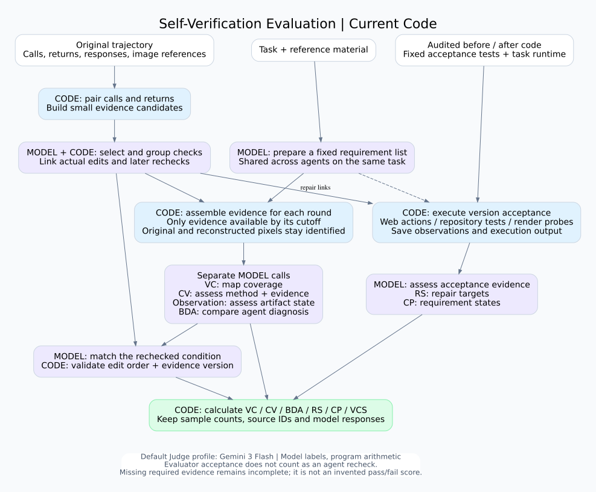
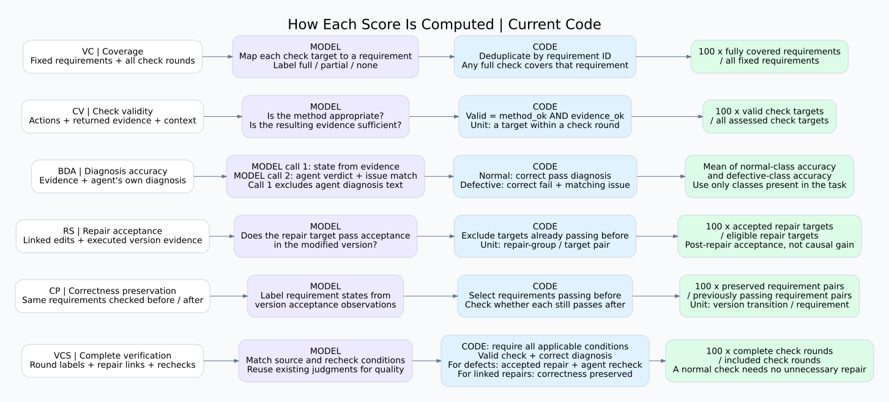

# How the six scores are computed

These diagrams describe the local implementation inspected on 2026-10-08,
protocol `requirement-level-20261006`. They do not report a new experiment or
change the scoring definitions. The configured default Judge is
`gemini-3-flash-preview`; an experiment can override its profile.

Purple boxes use model judgments; blue boxes use deterministic code; green boxes
are computed results. Models return validated labels and references, not numeric
scores. The displayed ratios assume complete, applicable evidence.

## Reading the scores

- **VC:** fraction of fixed task requirements with at least one `full` coverage
  label. Repeated checks do not increase coverage. `partial` is recorded but
  contributes no coverage credit in the current implementation.
- **CV:** fraction of actual check targets for which both the method and the
  resulting evidence are adequate. Its denominator is check targets, not distinct
  requirements or screenshot count.
- **BDA:** mean diagnosis accuracy across the normal and defective classes present
  in the task. The observation call excludes agent-response text; the diagnosis
  call then compares the agent's verdict with the fixed observation judgment.
  A defective target also requires the reported issue to match. Missing or
  uncertain agent diagnoses are incorrect when the actual state is decidable.
- **RS:** fraction of eligible repair targets passing post-repair acceptance.
  Targets already passing before the edit are excluded. An unresolved baseline
  does not prevent credit when the post-repair state passes. This measures
  acceptance, not proof that an edit caused improvement.
- **CP:** fraction of previously passing requirement/version-transition pairs
  that remain passing. A requirement tested across several edits contributes
  several pairs.
- **VCS:** fraction of included check rounds satisfying all applicable conditions:
  valid checking and correct diagnosis; for defective targets, accepted repair
  and a corresponding successful agent recheck; for linked repairs, preservation
  of correctness. A round with only normal targets does not need a repair.
  Independent evaluator acceptance does not substitute for an agent recheck.

Each round can contain multiple targets and evidence cutoffs. At a cutoff, VC,
CV, observation and BDA use separate calls with targets batched within the call.
Later diagnoses of the same target replace earlier hypotheses without adding a
second target to the denominator. Future edits and screenshots do not enter the
earlier round's evidence packet. Reconstructed observations retain their provenance.

The current code still records unresolved evidence. A metric with unresolved
labels does not receive a complete point score; an empty denominator is not
applicable. Multi-task summaries average available task scores with equal task
weight and preserve incompleteness. The six metrics are reported separately,
without a combined overall score.

Implementation sources: [metrics.py](../src/multimodalcode/vsv_eval/metrics.py),
[check_stages.py](../src/multimodalcode/vsv_eval/check_stages.py),
[evaluation.py](../src/multimodalcode/vsv_eval/evaluation.py) and
[states.py](../src/multimodalcode/vsv_eval/states.py).

The editable Graphviz sources and PNG exports are in `docs/figures/`. Regenerate
an image with `dot -Tpng docs/figures/vsv_metric_calculation.dot -o OUTPUT.png`.
