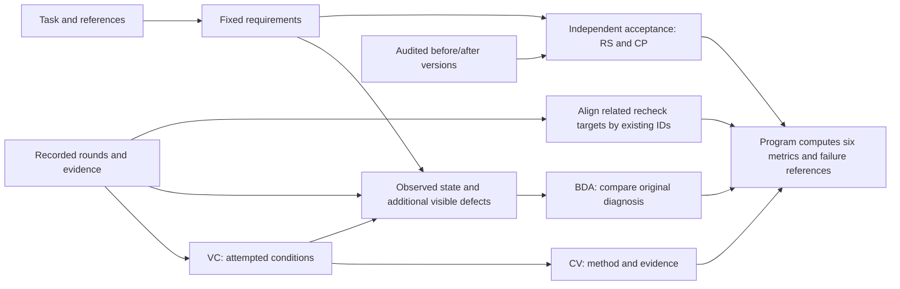

# Self-verification evaluation

For the single-command experiment runner and comparison outputs, see
[Run the scoring system](VSV_SYSTEM.md). The commands below remain available
for preparing inputs and inspecting individual stages.

The current protocol evaluates recorded visual and text checks. Models
return target labels and evidence IDs; Python computes six separate metrics.
Task criteria and fixed acceptance workflows are prepared and reviewed by the
configured model. Program validation freezes their IDs, sources and hashes.
No approval, adjudication or label correction by a person is required at runtime.

## Current protocol: requirement-level-20261009

A criterion is an independently falsifiable, user-facing requirement. Related details
of one requirement share a criterion; distinct functions and visual conditions remain
separate when they need different evidence or have different material failure modes.
Neither page count nor a desired score determines the number of criteria. Minor
presentation differences are tolerated; missing essential content and broken actions fail.
The same task catalogue is frozen before comparing agents. Existing frozen catalogues
are not silently regrouped: a revised catalogue requires a new experiment.



Observed-state judgment removes `model_text` and `reasoning` events, then supplies
its fixed verdict to the diagnosis call. It also scans core observation images
against the task and catalogue for material defects absent from the attempted
target list. It cannot use context-only images, unseen states or missing pixels
to invent a defect. This reduces selection by the agent's own reported findings;
these are model labels, not independently calibrated gold or a guarantee that
every visible defect has been found.
Recheck alignment matches the same condition across different wording/IDs within
existing repair links. It does not decide success. The program separately requires
new-version evidence, a valid check and a correct positive diagnosis for closure.
A homepage recheck cannot establish that another page was visually rechecked.

For each nonempty round prefix there are four batched calls: VC, CV, OBSERVATION,
BDA. An empty VC result without current image pixels needs only that call. With
current pixels, OBSERVATION still runs; BDA runs if it finds additional defects.
There is no second detector, vote or review call. One additional batched alignment
stage handles linked failures across the trajectory; large inputs use the existing
character-budget batching helper. It makes no calls when no alignment is needed.
RS/CP retain their separate acceptance calls and existing replay infrastructure.
All configured stages default to Gemini 3 Flash; actual calls are recorded in
`model_calls.json`. No voting, automatic model fallback or schema-correction loop is added.

`findings` contains original episode/target or edit/criterion references for invalid
methods, insufficient observations, missing diagnoses, false alarms, missed defects,
wrong defect identification, failed acceptance and observed regressions. These are
label-derived instances, not independent causal explanations or model-wide conclusions.

## Finding-oriented breakdowns

The six main metrics remain separate. Their diagnostic breakdowns reuse the same
labels and acceptance results rather than introducing more scoring calls.

- **Coverage:** new fixed criteria include `requirement_types`, a list containing
  `visual`, `interactive`, both, or neither. These describe what must be checked;
  target `modality` still describes the recorded evidence. A text/DOM result can
  cover an interactive requirement; HTTP 200 does not cover its appearance.
  `VC.by_requirement_type` uses each type's fixed requirement denominator and
  deduplicates repeated checks. Untyped historical criteria remain explicitly
  unclassified; they do not silently become nonvisual requirements.
- **Detection:** OBSERVATION returns `targets` plus `additional_defects`. The
  latter contains only `target`, `check_id`, `actual_issue` and `evidence_ids`.
  The program assigns stable IDs and marks their merged records
  `check_attempted=false`. They enter BDA, but cannot earn VC credit or enlarge
  CV's denominator. BDA still compares the last eligible original diagnosis
  against those observations. `BDA-V.error` reports recognition of judged visible
  defects, including omissions; normal cases retain the false-alarm check.
  Missing pixels do not mean that no defect existed. Reconstructed observations
  retain their explicit evidence mode and historical-equivalence limitation.
- **Repair:** `RS.diagnosed_visual` conditions on a correctly identified visual
  defect, a recorded related repair, and a confirmed failing acceptance baseline.
  Its samples are criterion-transition pairs, deduplicated across shared source
  rounds. Unverified baselines are counted separately. Overall RS retains its
  existing post-repair acceptance definition. Consecutive edits before a related
  recheck form an attempt; a later attempt cannot erase its failure.
- **Preservation:** `CP.repair_outcomes` joins local repair and regressions on
  each existing transition. A regression requires a previously passing non-target
  criterion to fail afterward. The joint table separates local success/failure
  from preservation/regression. Its regression rate is a failure frequency, so
  lower is better. Each transition keeps edit/version references and
  `visual_target_ids` for selecting repairs with visual targets; the overall
  transition table also retains nonvisual repairs. No extra acceptance call is made.

VCS remains an auxiliary round-level closure measure. These breakdowns do not
resolve its dependence on episode grouping and do not turn a few examples into
population-level findings. Use the same tasks, criteria, protocol and evidence
mode when comparing models; report denominators with the percentages.

## Code and data flow

| Module | Responsibility |
| --- | --- |
| `episodes.py`, `checks.py` | Existing event pairing, evidence provenance, check rounds and repair/recheck references |
| `catalogue.py` | Model-reviewed criteria/workflows, source validation and readable image views |
| `evaluation.py`, `check_stages.py` | Time-bounded evidence packets, separate VC/CV/BDA calls, stored-response validation and aggregation |
| `states.py` | Fixed checks on audited versions, separate RS/CP judgments and repair records |
| `repair_pilot.py`, `replay.py` | Existing version reconstruction, exact assertions and browser execution |
| `metrics.py` | VC, CV, BDA, RS, CP, VCS and task macro averages |
| `judge.py`, `report.py` | Existing model clients/cache/raw responses and result reports |

`scripts/vision2web/score_vsv.py` is the CLI. The former stage tools are retained
for historical reports and explicitly selected legacy commands. Their scores
are not converted into the six current metrics. No new model provider,
dependency, snapshot system, diff system or agent recorder is introduced.

## Commands

Configure `OPENAI_BASE_URL` and `OPENAI_API_KEY` in the environment. Credentials
are never written to the configuration, request records or reports.
`configs/vision2web/vsv_protocol.json` defaults all stages to `gemini3flash`
(`gemini-3-flash-preview`), including visual and text judgments. Each metric
retains its separate call. Other profiles remain available through an explicit
`--primary-profile` override; there is no automatic model fallback.

```bash
# Existing extraction: no workflow or image scoring.
python3 scripts/vision2web/score_vsv.py \
  --run-json path/to/run.json --extract-only \
  --config configs/vision2web/vsv_protocol.json \
  --output-dir runs/vsv_eval/rounds

# Draft fixed requirements without consulting an agent trajectory.
python3 scripts/vision2web/score_vsv.py \
  --draft-catalogue --task-root path/to/task \
  --output-dir runs/vsv_eval/catalogue

# Separate metric judgments for all recorded check rounds.
python3 scripts/vision2web/score_vsv.py \
  --rounds-json runs/vsv_eval/rounds/verification_rounds.json \
  --catalogue runs/vsv_eval/model_plan/catalogue.json \
  --task-root path/to/task --output-dir runs/vsv_eval/checks

# Independently test exact before/after versions with the same fixed criteria.
python3 scripts/vision2web/score_vsv.py \
  --rounds-json runs/vsv_eval/rounds/verification_rounds.json \
  --catalogue runs/vsv_eval/model_plan/catalogue.json \
  --state-spec runs/vsv_eval/model_plan/state_spec.json \
  --output-dir runs/vsv_eval/states

# Join validated stored results without additional model calls.
python3 scripts/vision2web/score_vsv.py \
  --check-results runs/vsv_eval/checks/scores.json \
  --repair-results runs/vsv_eval/states/repair_results.json \
  --output-dir runs/vsv_eval/combined
```

Prepare a model-reviewed plan without reading the coding trajectory:

```bash
python3 scripts/vision2web/score_vsv.py \
  --prepare-plan --task-root path/to/task \
  --catalogue path/to/draft/catalogue.json \
  --state-spec path/to/existing/state_spec.json \
  --primary-profile gemini3flash --output-dir runs/vsv_eval/model_plan
```

`--catalogue` and `--state-spec` are optional inputs. Without a state specification,
the output contains the model-prepared workflows; artifact/runtime bindings
still come from existing experiment configuration. The model cannot create
code versions, edit links or runtime commands. Necessary and repair goal IDs
are preserved when reviewing an existing plan; missing explicit requirements
may add necessary goals before the plan is frozen. Every goal has exactly one
workflow assignment or an explicit unresolved ID. Source conflicts and unsupported
setup remain unknown, and unresolved IDs are included in the criteria hash.
Malformed model output fails directly; there is no correction loop or voting.
The plan prompt supplies an output schema using the browser executor's action
and assertion vocabulary; the request uses JSON-object mode. Both action and
assertion records use `type` as the discriminator. Program checks
still reject invalid business inputs, unknown sources and omitted repair goals;
structured output does not certify that a test is semantically sufficient.
Model nodes return `checks` as rows containing `check_id` and `assertions`.
Python converts these rows into the existing executor map, preserving actions
and rejecting duplicate IDs. The raw model response remains unchanged.
Each visual goal must have a readable capture at its assigned node. The plan
uses full-page capture for static regions unless a prescribed scroll reaches
them; a different node's screenshot cannot substitute for that goal's evidence.
Initial routes and URL assertions must come from task sources; page names do
not supply literal paths. Unspecified destinations are reached through UI controls.
The default plan profile is `gemini3flash`; stage profiles remain configurable.
RS and CP receive their own target-scoped observations and reference images.
Shared nodes remain available to both metrics, and attachment indices follow
each request's actual image order.
Earlier nodes in the same workflow can provide pre-action context. A pass/fail
label must still cite its assigned result node; unrelated workflows and later
nodes cannot supply that target's evidence.

A task root contains `prompt.txt`, optional `workflow.json` and `prototypes/`.
Use `--prepare-plan` to review existing or new criteria and generate acceptance
workflows in one task-only model call. Its output records `review.status=model_reviewed`
and the original response. Use `--allow-draft` only for historical or unreviewed
pilots. Changing a frozen
criterion invalidates comparisons with earlier results.

`--offline` produces pending evidence packets and unknown model-dependent
labels; exact execution assertions remain available. It never treats missing
judges as successful checks. `--reference-map` reuses existing reference
associations. `--reuse-checks DIR` reuses completed original labels after
validating their source events, criteria, images and raw responses. Actual
prompts remain recorded, including any pilot revisions; formal comparisons
must use a fresh directory and one frozen judge configuration. `--workers`
bounds concurrent independent round evaluations.

For fixed-state execution, `--offline` can reuse valid response files already
in the output cache when their model, settings, prompt and images match exactly.
Uncached semantic states remain unknown and the state result is explicitly
partial. An invalid cached response still raises. Online model failures always
raise; offline processing is an explicit subsequent action, not an automatic
fallback or schema-correction loop.

## Minimal records

The necessary-check catalogue has six fields per goal:
`check_id`, `source_ref`, `setup`, `criterion`, `required_evidence`, `reference_ids`.
Its top level binds the task, source IDs, reference hashes, criteria hash and
review status. A draft does not replace the recorded model plan review.

Each target label has `target`, `check_id`, `coverage`, `method_ok`,
`evidence_ok`, `actual_state`, `actual_issue`, `agent_state`, `issue_match`,
`evidence_ids`, `diagnosis_ids` and `modality`. Python adds `target_id` for
stable target identity. Unmatched legitimate checks keep `check_id: null`;
they participate in conditional metrics without changing VC's denominator.

`modality` is `visual` when the target cites any recorded agent-observation image,
including image and text together, and `text` otherwise. Missing archived pixels
do not change recorded image receipt. Reference images and filenames alone do
not make a check visual. The program validates this label against event IDs.
Historical response files retain their original labels; their former mixed
group is included in visual summaries rather than reported separately.
`modality` records the evidence needed to judge the target, not tool keywords.

The merged `evidence_ids` remain the VC target references, consistent with its
modality. CV and BDA evidence references remain in their original linked responses;
BDA does not overwrite the target evidence.

These fields are assembled by the program from separate model responses:

| Call | Model output per target |
| --- | --- |
| VC | `check_id`, `target`, `coverage`, `evidence_ids`, `modality` |
| CV | `target_id`, `method_ok`, `evidence_ok`, `evidence_ids` |
| OBSERVATION | `target_id`, `actual_state`, `actual_issue`, `evidence_ids` |
| BDA | `target_id`, `agent_state`, `issue_match`, `diagnosis_ids` |

VC describes the actual attempted condition in `target`, including matched checks.
A catalogue link measures coverage without replacing a narrower condition used by
CV/BDA. Unmatched legitimate checks retain `check_id: null`. Unattempted catalogue
goals are omitted from round targets; Python still includes them in VC's fixed
denominator. Every target must cite a current action or observation, so a plan,
summary or context-only check cannot create a new conditional-metric sample.
Failed attempts remain eligible even when coverage is none or evidence is missing.
CV and OBSERVATION receive shared target definitions without coverage or validity verdicts.
OBSERVATION excludes agent narrative; BDA also receives its fixed observation verdicts. The coverage catalogue is omitted from these inputs: its broader conditions and
suggested independent acceptance procedures must not replace the agent's actual
check. The actual target condition, original task and reference images remain
available to judge relevance and correctness. Programmatic feedback can support
behavioral checks; appearance judgments still require pixels. They must label all supplied IDs exactly
once. Each call batches the targets in one time-bounded round prefix. The packet keeps
the direct preceding plan and pairs referenced context calls/results by their
original IDs. Relevant earlier setup and observations can support a continuing
test; they do not count as additional current attempts. A round need not complete
an entire multi-step plan. Future evidence and changes of implementation state
cannot be treated as evidence for an earlier observation. If VC finds
no applicable checks, the other calls are unnecessary. The VC prompt's previous
conditions contain identities only. No whole-trajectory grading, voting, schema
correction, new client or automatic acceptance of missing labels is introduced.

Each metric has its own input file, schema, stage, response and cache. Visual
and text stages both default to Gemini 3 Flash in the checked-in configuration. `--primary-profile` overrides them explicitly. Historical joint
records can still be inspected and recomputed, but cannot be reused as fresh
independent judgments. The merged target's `evidence_ids` remain VC references;
other evidence references remain in their original stage responses. Independent
verdicts may disagree; the program preserves them rather than forcing agreement.
Separate calls have not been shown to improve semantic accuracy.

Round results link their actual input packet and cached raw response. The
packet separates core event IDs from shared or earlier context IDs and lists
eligible current diagnosis IDs. Shared capture sources support the current
object; they do not contribute additional independent checks. For multiple
judgment times, only the relevant evidence prefix is supplied, and the last
substantive target diagnosis replaces earlier hypotheses.

State labels have only `check_id`, `state`, `evidence_ids`. Repair results link
them to original edit IDs, exact version boundaries and extraction relations.
Supplementary `repair_checks` have the same catalogue fields and require
review; they define legitimate unmatched repair criteria without enlarging VC.
`target_aliases` links their IDs to recorded unmatched target identities.

## Fixed state execution

A reviewed state specification supplies the fixture, existing version-source
configuration, runtime, routes, original functional probe ordinals,
per-target `assertion_adapters` and repair `transitions`. See the SmartRecruiters
pilot's `state_spec.json` for an executed example. Original browser functions
are run with reviewed reset routes and step captures; this is not a claim of
byte-identical replay of the original CLI or browser state.

The state runner records every fixed goal in every required version. Exact
assertions are evaluated mechanically before unresolved criteria are submitted
to separate RS and CP judges, grouped by the existing independent workflow.
Each call sees only that workflow and its relevant references. RS receives only associated repair goals;
CP receives all necessary fixed goals. Both see actual execution evidence and
neither receives the other's state labels. Exact assertions require no model call.
State results save `metric_results` and the requests for each metric/workflow batch.
Stored-result validation requires disjoint batches covering every pending criterion. Repair records use
`states` for RS and `preservation_states` for CP, preserving independent labels
even when a criterion is shared. VCS is a program conjunction, not another judge.
The same criterion and setup are used before and
after each actual repair. A failed probe or absent required interaction gives
unknown state, not an inferred application defect or a pass from a screenshot.

Browser replay uses the existing Node Playwright runner. Select a Node version
supported by the installed Playwright package and set `VSV_PLAYWRIGHT_PACKAGE`
and `VSV_CHROMIUM` to that package and browser executable. The local pilot's
exact environment is recorded in the implementation report; no dependencies
are installed automatically by the evaluator.

Code, resources and runtime settings bind the artifact identity. Execution
cache inputs include this identity, fixed criteria and the complete test
specification. Model caches additionally bind the prompt, model parameters,
endpoint and image bytes. Stored results reject changed resources, source
events, image evidence, criteria and version boundaries. Historical screenshots
retain their capture version; evaluator screenshots are never counted as
images received by the agent.

## Metric interpretation

| Metric | Unit and handling |
| --- | --- |
| VC | Full observed necessary goals, deduplicated by fixed `check_id`; partial coverage gets no fractional credit. Unknowns produce lower/upper bounds and no exact score. |
| CV | True only when method and evidence are both valid; a known invalid component dominates unknown. |
| BDA | Mean diagnosis accuracy over present normal/error classes; missing and uncertain diagnoses receive zero credit on decidable observations. Unresolved truth or issue matches produce bounds rather than an exact score; one-class groups use the present class. V/T groups use target evidence modality. |
| RS | Post-repair acceptance for actual linked repair attempts; a passing after-state counts even when the baseline is unknown. Known baseline passes remain excluded; an unknown after-state remains unknown. |
| CP | All fixed goals passing before each repair; incomplete baseline/after observations remain unknown and prevent a safety claim. |
| VCS | Conjunction of valid checks, correct diagnoses, necessary repair acceptance, preservation and a scoped agent recheck; any known failure dominates unavailable evidence. |

Every result reports applicable counts and unknowns. No overall weighted score
is generated. Macro BDA averages the per-task class-macro scores across
tasks, using each task's present classes and retaining their sample counts.
Coverage and behavior scores do not replace the benchmark's official final
quality evaluator.

## Outputs and limits

Check evaluation writes `scores.json`, `report.md`, per-round results, input
packets, image views and cached original responses. State evaluation writes
the frozen specification, existing reconstruction manifest, replay evidence,
fixed state labels and `repair_results.json`. The final join validates these
artifacts and recomputes metrics without calling a judge.

Missing pictures, inaccessible historical state, tool errors and model failures
must remain distinguishable. Invalid model JSON, IDs, temporal citations or
contradictory exact assertions raise an error; they are not automatic passes,
automatic drops or requests for schema-correction loops. Archived state can
only be evaluated when its relevant code and resources are recoverable.
Unassessed original repair links remain in `repair_gaps`, deduplicated by their
original modification IDs. RS reports the number of unassessed source episodes
without guessing how many repair targets they contain. Each missing artifact
pair contributes unknown fixed baseline checks to CP. Such gaps are not dropped
merely because another part of the trajectory can be replayed.

Historical SmartRecruiters outputs used draft criteria and Gemini-only judge
calls. They remain historical pilot results. New model review does not retroactively
validate their labels. Automated tests establish specific executor and judge behaviors,
not general semantic accuracy.

## Independent interaction acceptance

The existing `--state-spec` entry accepts `acceptance_workflows`. Each workflow
contains an explicit route/viewport `setup` and ordered `nodes`. A node stores
its requirement `source_ref`, prescribed `actions`, and a `checks` mapping from
fixed catalogue IDs to executable assertions. An empty assertion list requests
a semantic state judgment from the node's captured evidence. Several goals can
share one node. Actions live in the workflow rather than being copied into each
catalogue goal; the fixed goal IDs and scoring formulas remain unchanged.

```json
{
  "workflow_id": "panel",
  "setup": {"route": "/", "viewport": {"width": 1920, "height": 1080}},
  "nodes": [{
    "source_ref": "task:0",
    "actions": [{"type": "click", "description": "Open the panel.",
                 "target": {"role": "button", "name": "Open"}}],
    "checks": {"panel_content": [{"type": "text_visible", "value": "Panel content"}]},
    "fullpage": false
  }]
}
```

Model-reviewed workflows run through the automatic entry; `--allow-draft`
explicitly permits a historical or unreviewed pilot. `version_ids` can select
audited versions, but every supplied repair
transition must retain both endpoints. Unscheduled catalogue goals remain
unknown and prevent a claim of complete preservation. The plan model checks
that assertions collectively test the entire criterion.
The program validates their vocabulary and references. Neither validation proves
that every semantic judgment is correct.

The Node Playwright runner retains state across nodes and opens a fresh context
for each workflow. It records the prescribed actions, actual assertions, DOM,
screenshots and `run_status` independently of artifact pass/fail. This version
supports static/client workflows with explicit route/viewport setup. Backend
data resets and persistent state restoration require a certified setup and are
not silently inferred. UI actions/assertions start with a 5-second timeout and
30-action workflow budget; screenshot capture has a separate 10-second limit.
External font/stylesheet requests use a bounded wait recorded as
`evaluation_network_deadline`; that deadline alone does not establish an
implementation defect. Isolated versions use separate ports under `--workers`.
Waiting polls the specified condition. No force clicks, alternative business
paths or app repairs are used.

Stable locators run directly. If a planned role differs, a unique exact visible
text match can resolve click, hover or scroll without changing the label.
Scroll actions support explicit `axis` and `amount`. An unresolved element is grounded through the
existing JudgeClient `gui_step` stage, which defaults to
`gemini-3-flash-preview`. The model sees the current screenshot, available
element references, prescribed step and executed prefix. It can select one
current element or report blocked. Types, business inputs and observation IDs
are validated. Locator scopes also constrain the offered elements. Malformed
or failed model responses raise directly and retain the original response.
Offline execution reports unresolved grounding as blocked without calling a
model. Browser execution caches include the executor source hash and GUI
profile; model calls retain the existing cache and usage mechanism.

State packets attach the actual pixels of semantic workflow nodes, with
`origin=independent` and version/workflow/node evidence IDs. Exact-only nodes
keep their screenshots in the execution record without unnecessary image
attachments to the judge. Recorded probe step screenshots are also attached
when evaluating those probes. New observations never increase historical VC,
BDA evidence, agent image counts or extracted rounds. The state judge cannot
cite another node's unrelated target evidence.

## Input scope and model call accounting

VC keeps the fixed catalogue to identify covered targets. CV and BDA receive
the actual attempted target conditions and identities, with original task evidence;
they still make independent judgments. RS and CP first use exact assertion
results, then send only pending goals and their scoped evidence to the model.
Earlier observations in the same workflow remain available as context. These
changes do not alter metric formulas or permit future evidence.

`--reuse-checks` validates saved responses before any reference annotation.
Fully reused checks need no annotation call; partial reuse annotates only
missing rounds. Online runs save the actual metric inputs without an extra
unused copy. Offline runs still save their unjudged evidence packets.

New `--prepare-plan` calls keep supplementary repair goals used by the supplied
transitions. Necessary CP goals and preparation actions remain in the input.
Existing frozen plans and historical records are not rewritten. Image views
reuse existing files without decoding and cropping source pixels again.

Every `score_vsv.py` invocation writes `model_calls.json`, including on failure.
Its `api_requests` counts actual HTTP attempts, including retries and failed
requests; `cache_hits` counts JudgeClient invocations served from its cache. Each entry links
its stage, model, request hash, original response and check/version/input context.
Calls that return labels later rejected by a stage validator still count as
HTTP requests. `error_calls` describes request or response-parsing errors, not
every downstream validation failure. Reusing saved labels or replay executions
does not create a model call. Archived response files alone cannot establish
the number of requests made during a new invocation.

The append-only `judge_cache/**/model_calls.jsonl` files retain the call history.
The CLI report covers its current invocation; a cumulative report for one
output directory or a parent containing several runs is available without API
calls:

```bash
PYTHONPATH=src python3 - <<'PY'
from multimodalcode.vsv_eval.judge import write_model_call_report
report = write_model_call_report('runs/vsv_eval/your_run')
print(report['api_requests'], report['cache_hits'], report['by_stage'])
PY
```


### Diagnosis penalties and ambiguous requirements

BDA includes every evaluated target. When the actual state is known, missing or
uncertain agent diagnoses receive zero credit, just like an incorrect conclusion.
`absent_count` and `uncertain_count` describe agent behavior across all targets;
they are not exclusions or additional disjoint outcome groups. When the evaluator
cannot establish the actual state or issue match, the target remains unknown.

The result records `definition: macro_diagnosis_accuracy_over_present_classes`.
`known_score` is balanced accuracy on decidable labels only. If unknowns remain,
`score` is null and the report shows `lower_bound`–`upper_bound` for the full target
set, not the known-subset score. Bounds vary the unknown actual-class allocation
and unresolved issue matches. Missing/uncertain diagnoses never earn credit in
any completion. These are evidence uncertainty bounds, not confidence intervals.
The class mean uses classes actually present; one-class tasks report that class accuracy
with its count. No samples still means no applicable score. Cross-task aggregation rejects the superseded expressed-only
formula. Its archived 100% result must not be used as the current BDA result.
VCS uses the same diagnosis penalty and still requires a complete verification
loop. No model labels are rewritten when these metrics are recomputed.

The direct response after a round's final observation is eligible even if the
extractor assigned it to the next round. It is referenced as context without
importing that round's operations. The scan stops at the next operation or session
boundary; delayed summaries are not automatically attached to every earlier check.

An unresolved expected value does not automatically make an observed inspection
unknown. VC describes the actual attempted property before mapping it to catalogue
coverage. Static appearance, HTTP availability and an interactive behavior are
distinct conditions; a catalogue match must not broaden the attempted check.
CV and BDA judge that scoped condition. BDA no longer forces every target mapped
to an unresolved criterion to unknown. Minor wording, spacing and decoration
conflicts may accept either supplied source variant when meaning, content and
functionality are preserved. Missing content and broken actions still fail.
Task examples do not mandate exact values. Static images cannot establish
interactive behavior, and a partial batch cannot prove an all-items conclusion.
Completed subtests retain their own evidence even if the batch later times out.
Required missing pixels, missing interaction observations and material unresolved
conflicts still cannot be invented into pass/fail artifact states. Missing agent
diagnoses remain penalized on decidable evidence. The present-class BDA formula and
its uncertainty bounds are unchanged. Original labels and historical experiment
outputs remain immutable; rerun affected stages into a new output directory.


### Acceptance tolerance

RS records `definition: post_repair_acceptance`. It reports whether the repaired
target passes its after-state acceptance, not whether a causal improvement from
a proven defect has been established. Original before-state uncertainty remains
in the evidence record. An unknown after-state cannot receive credit.

For CP, minor wording, spacing, or decoration differences are acceptable when
the required meaning, visible content, and functionality remain intact. Missing
content, broken interactions, and unreadable controls still violate their criteria.
A source-conflicted visual criterion may reuse completed captures associated with
the same reference page. The scoped input records `evidence_assignments` and
`acceptance_policy`; original execution rows and assigned check IDs are unchanged.
The model must locate the relevant region and cite actual execution evidence.
Without sufficient evidence or a defensible resolution, the verdict remains unknown.
The capture reuse mechanism affects CP acceptance only. Recorded-agent BDA uses
the same tolerance for minor source variants, but only evidence available at the
time of the agent's diagnosis; later acceptance captures cannot backfill it.

Completed navigation actions and recorded destination URLs are valid behavioral
evidence. Intermediate screenshots are not mandatory when the tested condition
is established by those observations. This does not infer behavior from a static
image or treat every unknown verdict as a pass.
